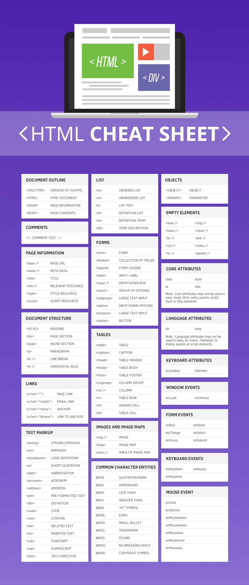
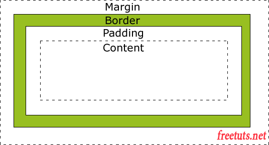

#### I. HTML5/CSS


Html5 có hỗ trợ Local Storage dùng để lưu trữ dữ liệu tạm. Hiện nay, mỗi cookie chỉ cho phép lưu trữ tối đa 4KB và vài chục cookie cho một domain. Vì thế cookie chỉ được dùng để lưu trữ những thông tin đơn giản và ngắn gọn như email, username,... Điều này khiến cho những trang web muốn nâng cao hiệu suất làm việc bằng cách cache dữ liệu tại client hầu như không thể thực hiện được. Local Storage có công dụng tương tự như cookie, có nghĩa là nó sẽ lưu trữ thông tin trên browser mà người dùng đang truy cập. Điểm khác biệt lớn nhất giữa Cookie và Local Storage là Local Storage cho phép bạn lưu trữ thông tin tương đối lớn lên đến 5MB, ngoài ra local storage không gửi thông tin lên server như Cookie.

#### 1  CSS3

CSS3 là một chuẩn mới nhất của CSS, hay nói cách khác nó là một Version mới của CSS. Nó được chia ra làm nhiều module và mỗi module sẽ có những nhiệm vụ khác nhau, khi kết hợp chúng với nhau sẽ tạo nên những hiệu ứng tuyệt vời.

CSS3 được tách nhỏ thành nhiều module và nó có luôn các module của CSS cũ. Sau đây là các modules:

* Selectors
* Box Model
* Backgrounds and Borders
* Image Values and Replaced 
* Content
* Text Effects
* 2D/3D Transformations
* Animations
* Multiple Column Layout
* User Interface

##### 1.1 selector

```
* {
 margin: 0;
 padding: 0;
}
```
Với * có nghĩa là chọn tất cả elements


cũng có thể sử dụng để chọn tất cả các elements trong 1 element. Ví dụ:
```
#container * {
 border: 1px solid black;
}
```
=> áp dụng cho tất cả các elements là con của `#container`.

<table class="w3-table-all notranslate">
  <tbody><tr>
    <th style="width:20%">Selector</th>
    <th style="width:20%">Example</th>
    <th>Example description</th>
  </tr>
  <tr>
    <td><a href="sel_class.asp">.<i>class</i></a></td>
    <td class="notranslate">.intro</td>
    <td>Selects all elements with class="intro"</td>
  </tr>
  <tr>
    <td><a href="sel_id.asp">#<i>id</i></a></td>
    <td class="notranslate">#firstname</td>
    <td>Selects the element with id="firstname"</td>
  </tr>  <tr>
    <td><a href="sel_all.asp">*</a></td>
    <td class="notranslate">*</td>
    <td>Selects all elements</td>
  </tr>
  <tr>
    <td><i><a href="sel_element.asp">element</a></i></td>
    <td class="notranslate">p</td>
    <td>Selects all &lt;p&gt; elements</td>
  </tr>
  <tr>
    <td><i><a href="sel_element_comma.asp">element,element</a></i></td>
    <td class="notranslate">div, p</td>
    <td>Selects all &lt;div&gt; elements and all &lt;p&gt; elements</td>
  </tr>
  <tr>
    <td><a href="sel_element_element.asp"><i>element</i> <i>element</i></a></td>
    <td class="notranslate">div p</td>
    <td>Selects all &lt;p&gt; elements inside &lt;div&gt; elements</td>
  </tr>
  <tr>
    <td><a href="sel_element_gt.asp"><i>element</i>&gt;<i>element</i></a></td>
    <td class="notranslate">div &gt; p</td>
    <td>Selects all &lt;p&gt; elements where the parent is a &lt;div&gt; element</td>
  </tr>
  <tr>
    <td><a href="sel_element_pluss.asp"><i>element</i>+<i>element</i></a></td>
    <td class="notranslate">div + p</td>
    <td>Selects all &lt;p&gt; elements that are placed immediately after &lt;div&gt; elements</td>
  </tr>
  <tr>
    <td><a href="sel_gen_sibling.asp"><i>element1</i>~<i>element2</i></a></td>
    <td>p ~ ul</td>
    <td>Selects every &lt;ul&gt; element that are preceded by a &lt;p&gt; element</td>
  </tr>
  <tr>
    <td><a href="sel_attribute.asp">[<i>attribute</i>]</a></td>
    <td class="notranslate">[target]</td>
    <td>Selects all elements with a target attribute</td>
  </tr>
  <tr>
    <td><a href="sel_attribute_value.asp">[<i>attribute</i>=<i>value</i>]</a></td>
    <td class="notranslate">[target=_blank]</td>
    <td>Selects all elements with target="_blank"</td>
  </tr>
  <tr>
    <td><a href="sel_attribute_value_contains.asp">[<i>attribute</i>~=<i>value</i>]</a></td>
    <td class="notranslate">[title~=flower]</td>
    <td>Selects all elements with a title attribute containing the word "flower"</td>
  </tr>
  <tr>
    <td><a href="sel_attribute_value_lang.asp">[<i>attribute</i>|=<i>value</i>]</a></td>
    <td class="notranslate">[lang|=en]</td>
    <td>Selects all elements with a lang attribute value starting with "en"</td>
  </tr>
  <tr>
    <td><a href="sel_attr_begin.asp">[<i>attribute</i>^=<i>value</i>]</a></td>
    <td>a[href^="https"]</td>
    <td>Selects every &lt;a&gt; element whose href attribute value begins with "https"</td>
  </tr>
  <tr>
    <td><a href="sel_attr_end.asp">[<i>attribute</i>$=<i>value</i>]</a></td>
    <td>a[href$=".pdf"]</td>
    <td>Selects every &lt;a&gt; element whose href attribute value ends with ".pdf"</td>
  </tr>
  <tr>
    <td><a href="sel_attr_contain.asp">[<i>attribute</i>*=<i>value</i>]</a></td>
    <td>a[href*="w3schools"]</td>
    <td>Selects every &lt;a&gt; element whose href attribute value contains the substring "w3schools"</td>
  </tr>
  <tr>
    <td><a href="sel_active.asp">:active</a></td>
    <td class="notranslate">a:active</td>
    <td>Selects the active link</td>
  </tr>
  <tr>
    <td><a href="sel_after.asp">::after</a></td>
    <td class="notranslate">p::after</td>
    <td>Insert something after the content of each &lt;p&gt; element</td>
  </tr>
  <tr>
    <td><a href="sel_before.asp">::before</a></td>
    <td class="notranslate">p::before</td>
    <td>Insert something before&nbsp;the content of each &lt;p&gt; element</td>
  </tr>
  <tr>
    <td><a href="sel_checked.asp">:checked</a></td>
    <td>input:checked</td>
    <td>Selects every checked &lt;input&gt; element</td>
  </tr>
  <tr>
    <td><a href="sel_default.asp">:default</a></td>
    <td>input:default</td>
    <td>Selects the default &lt;input&gt; element</td>
  </tr>
  <tr>
    <td><a href="sel_disabled.asp">:disabled</a></td>
    <td>input:disabled</td>
    <td>Selects every disabled &lt;input&gt; element</td>
  </tr>
  <tr>
    <td><a href="sel_empty.asp">:empty</a></td>
    <td>p:empty</td>
    <td>Selects every &lt;p&gt; element that has no children (including text nodes)</td>
  </tr>
  <tr>
    <td><a href="sel_enabled.asp">:enabled</a></td>
    <td>input:enabled</td>
    <td>Selects every enabled &lt;input&gt; element</td>
  </tr>
  <tr>
    <td><a href="sel_firstchild.asp">:first-child</a></td>
    <td class="notranslate">p:first-child</td>
    <td>Selects every &lt;p&gt; element that is the first child of its parent</td>
  </tr>
  <tr>
    <td><a href="sel_firstletter.asp">::first-letter</a></td>
    <td class="notranslate">p::first-letter</td>
    <td>Selects the first letter of every &lt;p&gt; element</td>
  </tr>
  <tr>
    <td><a href="sel_firstline.asp">::first-line</a></td>
    <td class="notranslate">p::first-line</td>
    <td>Selects the first line of every &lt;p&gt; element</td>
  </tr>
  <tr>
    <td><a href="sel_first-of-type.asp">:first-of-type</a></td>
    <td>p:first-of-type</td>
    <td>Selects every &lt;p&gt; element that is the first &lt;p&gt; element of its parent</td>
  </tr>
  <tr>
    <td><a href="sel_focus.asp">:focus</a></td>
    <td class="notranslate">input:focus</td>
    <td>Selects the input element which has focus</td>
  </tr>
  <tr>
    <td><a href="sel_hover.asp">:hover</a></td>
    <td class="notranslate">a:hover</td>
    <td>Selects links on mouse over</td>
  </tr>
  <tr>
    <td><a href="sel_in-range.asp">:in-range</a></td>
    <td class="notranslate">input:in-range</td>
    <td>Selects input elements with a value within a specified range</td>
  </tr>
  <tr>
    <td><a href="sel_indeterminate.asp">:indeterminate</a></td>
    <td class="notranslate">input:indeterminate</td>
    <td>Selects input elements that are in an indeterminate state</td>
  </tr>
  <tr>
    <td><a href="sel_invalid.asp">:invalid</a></td>
    <td class="notranslate">input:invalid</td>
    <td>Selects all input elements with an invalid value</td>
  </tr>
  <tr>
    <td><a href="sel_lang.asp">:lang(<i>language</i>)</a></td>
    <td class="notranslate">p:lang(it)</td>
    <td>Selects every &lt;p&gt; element with a lang attribute equal to "it" (Italian)</td>
  </tr>
  <tr>
    <td><a href="sel_last-child.asp">:last-child</a></td>
    <td>p:last-child</td>
    <td>Selects every &lt;p&gt; element that is the last child of its parent</td>
  </tr>
  <tr>
    <td><a href="sel_last-of-type.asp">:last-of-type</a></td>
    <td>p:last-of-type</td>
    <td>Selects every &lt;p&gt; element that is the last &lt;p&gt; element of its parent</td>
  </tr>
  <tr>
    <td><a href="sel_link.asp">:link</a></td>
    <td class="notranslate">a:link</td>
    <td>Selects all unvisited links</td>
  </tr>
  <tr>
    <td><a href="sel_not.asp">:not(<i>selector</i>)</a></td>
    <td>:not(p)</td>
    <td>Selects every element that is not a &lt;p&gt; element</td>
  </tr>
  <tr>
    <td><a href="sel_nth-child.asp">:nth-child(<i>n</i>)</a></td>
    <td>p:nth-child(2)</td>
    <td>Selects every &lt;p&gt; element that is the second child of its parent</td>
  </tr>
  <tr>
    <td><a href="sel_nth-last-child.asp">:nth-last-child(<i>n</i>)</a></td>
    <td>p:nth-last-child(2)</td>
    <td>Selects every &lt;p&gt; element that is the second child of its parent, counting from the last child</td>
  </tr>
  <tr>
    <td><a href="sel_nth-last-of-type.asp">:nth-last-of-type(<i>n</i>)</a></td>
    <td>p:nth-last-of-type(2)</td>
    <td>Selects every &lt;p&gt; element that is the second &lt;p&gt; element of its parent, counting from the last child</td>
  </tr>
  <tr>
    <td><a href="sel_nth-of-type.asp">:nth-of-type(<i>n</i>)</a></td>
    <td>p:nth-of-type(2)</td>
    <td>Selects every &lt;p&gt; element that is the second &lt;p&gt; element of its parent</td>
  </tr>
  <tr>
    <td><a href="sel_only-of-type.asp">:only-of-type</a></td>
    <td>p:only-of-type</td>
    <td>Selects every &lt;p&gt; element that is the only &lt;p&gt; element of its parent</td>
  </tr>
  <tr>
    <td><a href="sel_only-child.asp">:only-child</a></td>
    <td>p:only-child</td>
    <td>Selects every &lt;p&gt; element that is the only child of its parent</td>
  </tr>
  <tr>
    <td><a href="sel_optional.asp">:optional</a></td>
    <td class="notranslate">input:optional</td>
    <td>Selects input elements with no "required" attribute</td>
  </tr>
  <tr>
    <td><a href="sel_out-of-range.asp">:out-of-range</a></td>
    <td class="notranslate">input:out-of-range</td>
    <td>Selects input elements with a value outside a specified range</td>
  </tr>
  <tr>
    <td><a href="sel_placeholder.asp">::placeholder</a></td>
    <td class="notranslate">input::placeholder</td>
    <td>Selects input elements with placeholder text</td>
  </tr>
  <tr>
    <td><a href="sel_read-only.asp">:read-only</a></td>
    <td class="notranslate">input:read-only</td>
    <td>Selects input elements with the "readonly" attribute specified</td>
  </tr>
  <tr>
    <td><a href="sel_read-write.asp">:read-write</a></td>
    <td class="notranslate">input:read-write</td>
    <td>Selects input elements with the "readonly" attribute NOT specified</td>
  </tr>
  <tr>
    <td><a href="sel_required.asp">:required</a></td>
    <td class="notranslate">input:required</td>
    <td>Selects input elements with the "required" attribute specified</td>
  </tr>
  <tr>
    <td><a href="sel_root.asp">:root</a></td>
    <td>:root</td>
    <td>Selects the document's root element</td>
  </tr>
  <tr>
    <td><a href="sel_selection.asp">::selection</a></td>
    <td>::selection</td>
    <td>Selects the portion of an element that is selected by a user</td>
  </tr>
  <tr>
    <td><a href="sel_target.asp">:target</a></td>
    <td>#news:target </td>
    <td>Selects the current active #news element (clicked on a URL containing that anchor name)</td>
  </tr>
  <tr>
    <td><a href="sel_valid.asp">:valid</a></td>
    <td class="notranslate">input:valid</td>
    <td>Selects all input elements with a valid value</td>
  </tr>
  <tr>
    <td><a href="sel_visited.asp">:visited</a></td>
    <td class="notranslate">a:visited</td>
    <td>Selects all visited links</td>
  </tr>
</tbody></table>

##### 1.2. box model

Kết hợp ba thuộc tính margin, padding và border sẽ cho ta một mô hình với tên gọi là Box Model, Box Model thể hiện được sơ đồ các thuộc tính xác định vị trí của đối tượng HTML



Trong mô hình này thì:

* Đường xọc ngoài cùng là đường biên 
* Tiếp theo khoảng cách giữa đường biên so với đường border (màu xanh) ta gọi là margin.
* Tiếp khoảng cách giữa border so với nội dung bên trong ta gọi là padding.

##### 1.3 Media Queries

Media Query là một trong những module mới được thêm vào trong CSS3. Nó là một sự cải thiện của Media Type đã có từ CSS2, bằng việc thêm vào những cú pháp query để ta có thể đáp ứng được cho nhiều device với nhiều kích cỡ màn hình khác nhau.

Media Type vốn đã có từ CSS2, nó giúp ta xác định định dạng của mỗi loại thiết bị. Tất cả các giá trị của Media Type bao gồm

* All: Dùng cho tất cả các loại Media Type
* Aural: Dùng cho speech and sound synthesizers
* Braille: Dùng cho các devices liên quan đến chữ nổi (braille)
* Embossed: Dùng cho các loại máy in các trang braille
* Handheld: Dùng cho các thiết bị nhỏ, thiết bị cầm tay
* Print: Dùng cho máy in
Projection: Dùng cho các loại máy chiếu
* Screen: Dùng cho computer screen
* Tty: Dùng cho các thiết bị sử dụng fixed-pitch character grid
* Tv: Dùng cho các loại TV

Ví dụ: Thay đổi background khi chiều rộng của màn hình thay đổi.

```html
<!DOCTYPE html>
<html>
<head>
<style>
body {
  background-color: tan;
  color: black;
}

/* On screens that are 992px wide or less, the background color is blue */
@media screen and (max-width: 992px) {
  body {
    background-color: blue;
    color: white;
  }
}
 background color
/* On screens that are 600px wide or less, the is olive */
@media screen and (max-width: 600px) {
  body {
    background-color: olive;
    color: white;
  }
}
</style>
</head>
<body>

<h1>Resize the browser window to see the effect!</h1>
<p>By default, the background color of the document is "tan". If the screen size is 992px or less, the color will change to "blue". If it is 600px or less, it will change to "olive".</p>

</body>
</html>
```

##### 1.4 Flexbox

<b>display: flex</b>

<b>flex-direction:</b> 
* row
* row-reverse;
* column
* column-reverse

<b>flex-wrap: wrap</b>
<b>flex-wrap: nowrap</b> The nowrap value specifies that the flex items will not wrap (this is default):
<b>flex-wrap: wrap-reverse</b>

The `flex-flow` property is a shorthand property for setting both the `flex-direction` and `flex-wrap` properties.

<b>justify-content</b> The justify-content property is used to align the flex items

* justify-content: center
* justify-content: flex-start (default)
* justify-content: flex-end
* justify-content: space-around

<b>align-items</b>  property is used to align the flex items vertically.

* align-items: center
* align-items: flex-start
* align-items: flex-end
* align-items: stretch (default)
* align-items: baseline


<b>align-content</b>
* `align-content: space-between` The space-between value displays the flex lines with equal space between them:
* `align-content: space-around` The space-around value displays the flex lines with space before, between, and after them:

* `align-content: stretch` The stretch value stretches the flex lines to take up the remaining space (this is default):
* `align-content: center`  The center value displays display the flex lines in the middle of the container
* `align-content: flex-start` The flex-start value displays the flex lines at the start of the container
* `align-content: flex-end` The flex-end value displays the flex lines at the end of the container

##### Child Elements (Items)

<b>order</b>
The `order` property specifies the order of the flex items

* <b>flex-grow</b>
The `flex-grow` property specifies how much a flex item will grow relative to the rest of the flex items

* <b>flex-shrink</b>
The `flex-shrink` property specifies how much a flex item will shrink relative to the rest of the flex items

* <b>flex-basis</b>
The `flex-basis` property specifies the initial length of a flex item.

<b>align-self</b>

The `align-self` property specifies the alignment for the selected item inside the flexible container.
* `align-self: center`
* `align-self: flex-start`
* `align-self: flex-end`

#### II. Vanilla JavaScript


#### 2.1 callback
callback tức là ta truyền một đoạn code <b>(Hàm A)</b> này vào một đoạn code khác <b>(Hàm B)</b>. Tới một thời điểm nào đó, Hàm A sẽ được hàm B gọi lại <b>(callback)</b>.

```javascript
function doHomework(subject, callback) {
  alert(`Starting my ${subject} homework.`);
  callback();
}

doHomework('math', function() {
  alert('Finished my homework');
});
```
##### callback hell


Code theo kiểu hàm gọi hàm liên tiếp như dưới đây gọi là callback hell. Các code kiểu này rất khó chịu và khó debug.

```javascript
function foo(cb) {
    cb();
}
function bar(cb) {
    cb();
}
function olala(cb) {
    cb();
}

function do_it(){
    foo(function() {
        bar(function() {
            olala(function() {
                console.log("aizz.... ==!");
            })
        })
    })
}
```

Cách khắc phục: Code cho sạch lại hoặc sử dụng `promise` trong javascript.

#### 2.2 Promise

Sử dụng hàm `resolved()` trong promise

```javascript
<script>

new Promise((resolve, reject) => {
    console.log('Initial');

    resolve();
})
.then(() => {

    console.log('Do this');
})
.catch(() => {
    console.log('Do that');
})
.then(() => {
    console.log('Do this, no matter what happened before');
});

</script>

```

Sử dụng hàm `reject()` trong promise

```javascript
<script>

new Promise((resolve, reject) => {
    console.log('Initial');

    reject();
})
.then(() => {

    console.log('Do this');
})
.catch(() => {
    console.log('Do that');
})
.then(() => {
    console.log('Do this, no matter what happened before');
});

</script>
```

`catch()` trong promise sẽ được thực thi ngay khi `reject()` được gọi

#### 2.3 Async/wait trong javascript
hàm async (async / await). Hàm async cho phép ta viết các thao tác bất đồng bộ với phong cách của các mã đồng bộ. Bằng cách viết như vậy, mã nguồn của ta trông sẽ sáng sủa, dễ đọc hơn và "dễ hiểu hơn".

async/await giúp các hàm cần đợi một xử lý bất đồng bộ.

```javascript
function wait(ms) {
   return new Promise(r => setTimeout(r, ms))  
}

async function main() {
   console.log('sắp rồi...')
   await wait(2007)
   console.log('chờ tí...')
   await wait(2012)
   console.log('thêm chút nữa thôi...')
   await wait(2016)
   console.log('xong rồi đấy!')
}
```

`trycatch` trong `asyn`
```javascript
function wait(ms) {
   if (ms > 2015) throw new Error(ms)
   return new Promise(r => setTimeout(r, ms))
}

async function main() {
	try {
   console.log('sắp rồi...')
   await wait(2007)
   console.log('chờ tí...')
   await wait(2012)
   console.log('thêm chút nữa thôi...')
   await wait(2016)
   console.log('xong rồi đấy!')
   } catch (e) {
     console.log(`có vấn đề tại ${ e }`)
   }
}
```


#### 2.4 OOP trong JavaScript
OOP trong javascript rất sida bởi vì nó không có từ khóa kế thừa `extends` như trong java, hay thậm chí từ khóa khai báo một class `class`.

Trong javascript, để khai báo một đối tượng tất cả trường và hàm đều được bao đóng trong một `function`

```javascript
function Person(firstName, lastName) {
  this.firstName = firstName;
  this.lastName = lastName;
  this.showName = function() {
     console.log(this.firstName + ' ' + this.lastName);
  };
}
```
Để kế thừa trong javascript ta dùng từ khóa `prototype`. rất củ chuối

```javascript
function Person() {
  this.firstName = 'Per';
  this.lastName = 'son';
  this.sayName = function() { return this.firstName + ' ' + this.lastName };
}

// Viết một Constructor Function khác
function SuperMan(firstName, lastName) {
  this.firstName = firstName;
  this.lastName = lastName;
}
SuperMan.prototype = new Person();
var sm = new SuperMan('Nam', 'Huy');
alert(sm.sayName());
```


#### 2.4 Prototype

`prototype` cho phép một thêm vào một đối tượng các `propertie` cũng như các `function` bên ngoài đối tượng.

Ví dụ:

```javascript
function Person(first, last, age, eyecolor) {
  this.firstName = first;
  this.lastName = last;
  this.age = age;
  this.eyeColor = eyecolor;
}

Person.prototype.nationality = "English";
```

```javascript
function Person(first, last, age, eyecolor) {
  this.firstName = first;
  this.lastName = last;
  this.age = age;
  this.eyeColor = eyecolor;
}

Person.prototype.name = function() {
  return this.firstName + " " + this.lastName;
};
```
